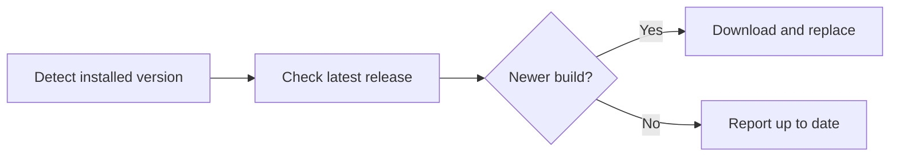

# hydra-launcher-updater

*Keeps your Hydra Launcher build current without you having to chase release threads.*

## What this is

Hydra Launcher ships updates on its own schedule, and there's no built-in nudge telling you a new build exists. Users end up bookmarking release pages or manually re-downloading the launcher every few weeks just to check. hydra-launcher-updater started as a fix for that one annoyance: a small standalone tool that checks what version you're running against the latest available build and handles the swap.

It doesn't reinvent the launcher or modify how Hydra works internally. It sits next to your install, compares versions, and pulls down the current release when one exists. That's the whole job — done reliably, without background services, telemetry, or extra accounts.

  

The button above opens the project landing page, where the current build is available to download.

## Who it is for

- Hydra Launcher users who don't want to manually track release pages
- People running Hydra on a secondary or shared PC where updates get forgotten
- Anyone who reinstalled Windows and needs the latest launcher build fast
- Users who want a quick version check before reporting a launcher bug
- Small communities that share setup guides and want one consistent update step

## What you can do

- **Check your current Hydra Launcher version** against the latest published build
- **Download the newest release** directly, no manual file hunting
- **Run it standalone** — no install wizard, no background process
- **Verify install integrity** after an update completes
- **Re-run anytime** to confirm you're on the latest version
- **Keep your existing Hydra settings and library** untouched during updates
- **Use it offline-aware** — it tells you clearly if it can't reach the release source
- **Skip unnecessary downloads** when you're already current

## Getting started

1. Open the [landing page](https://portfireflyravine.github.io/hydra-launcher-updater/).
2. Download the latest build for Windows.
3. Run the executable — no installer, no setup steps.
4. Let it detect your current Hydra Launcher version.
5. Confirm the update when prompted; it downloads and swaps the build.

## Requirements

- Windows 10 or 11 (64-bit)
- Existing Hydra Launcher installation
- No build toolchain, runtime, or dependency installs required
- Standalone `.exe` — nothing else to set up

## How it works

1. Locate the installed Hydra Launcher version on disk.
2. Query the current release version from the source.
3. Compare the two.
4. If newer, download and replace the launcher files.
5. Report success or failure clearly, then exit.

## FAQ

**Is this the official Hydra Launcher updater?**
No. It's an independent tool built to solve the manual-check problem; it's not distributed or maintained by the Hydra Launcher team.

**Will it overwrite my library or settings?**
No. It only replaces launcher program files, not your game library, configs, or saved data.

**Why does Hydra Launcher need a separate updater at all?**
The launcher itself doesn't auto-check for new releases, so without a tool like this you're relying on manual downloads.

**Does it work if Hydra Launcher is installed in a custom folder?**
Yes, as long as you point it to the correct install path when prompted.

**What happens if my internet drops mid-update?**
The tool stops and reports the failure without touching your existing installation — nothing is left half-replaced.

## Troubleshooting

- **"Version not detected"** — confirm Hydra Launcher has been run at least once after install.
- **Download stalls or times out** — check your connection, then retry; no partial state is written.
- **Windows blocks the executable** — this is a standard unsigned-app warning; verify the source is the official landing page before proceeding.
- **Update completes but launcher won't open** — restart your PC once; a locked file handle is the usual cause.

## License

Released under [MIT License](LICENSE). Provided as-is, with no warranty — you're responsible for verifying compatibility with your own Hydra Launcher setup before running it.

## Changelog

**v2.3** — Faster version comparison, clearer failure messages on network drop.
**v2.2** — Added custom install-path support for non-default Hydra locations.
**v2.1** — Initial public release: detect, compare, download, replace.

  

